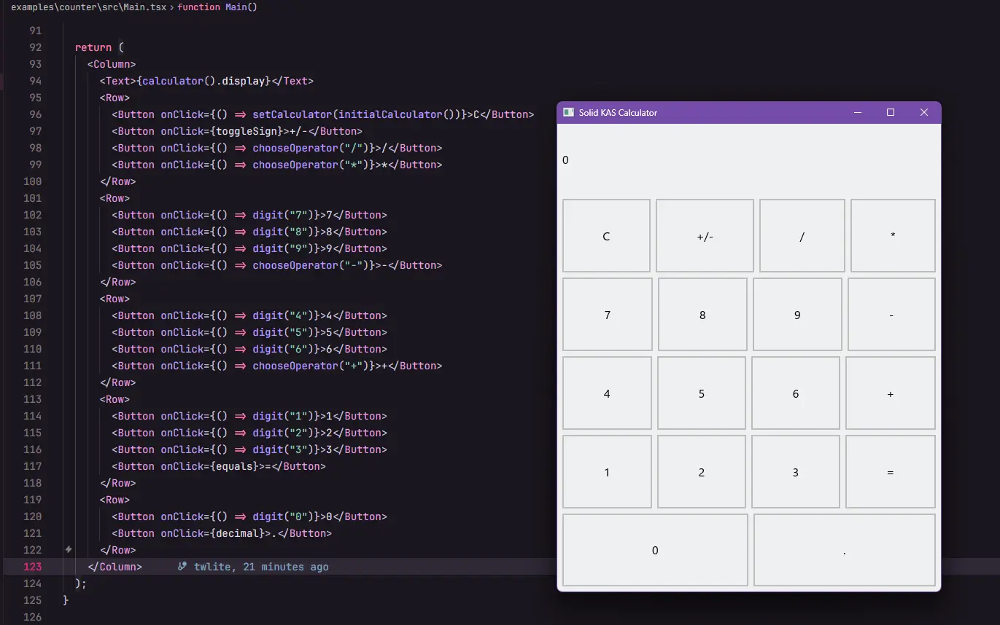

# Solid KAS prototype



This workspace renders SolidJS components as native KAS widgets inside one Rust process. QuickJS evaluates the Vite-transformed application modules. The application runtime contains no browser, DOM, WebView, Node.js process, frontend/backend split, or IPC application layer.

The prototype intentionally supports only `Column`, `Row`, `Text`, `Button`, children, text updates, and `onClick`.

## Prerequisites

- Rust with the stable MSVC toolchain
- Node.js
- pnpm 10

Install JavaScript tooling once:

```powershell
pnpm install
```

## Development

Build the reusable native development host once:

```powershell
pnpm bootstrap
```

Start Vite and the cached native host:

```powershell
pnpm dev
```

Normal TS and TSX edits do not run Cargo. Vite transforms the affected module graph and sends JSON Lines messages over a loopback socket to the existing native process. The host disposes the previous Solid root and QuickJS context, evaluates the new graph, and rebuilds the three-widget KAS subtree in the same window. Reloaded application state is intentionally reset.

Button clicks call the registered Solid callback synchronously inside QuickJS. Solid signal updates change the native model, and KAS refreshes the visible widget tree through its event queue.

## Production

Build the JavaScript payload, embed it into the release host, and create the standalone executable with one command:

```powershell
pnpm build
```

The output is:

```text
examples/counter/dist/calculator.exe
```

The payload file is removed after Cargo embeds it. The executable runs without Vite, Node.js, or the source tree.

## Checks

```powershell
pnpm test
pnpm typecheck
cargo test -p kas-runtime
cargo fmt --all -- --check
$env:RUSTFLAGS = "-D warnings"
cargo clippy -p kas-runtime --all-targets
Remove-Item Env:RUSTFLAGS
```

## Workspace layout

- `packages/vite`: Vite plugin, transformed module graph transport, dev host lifecycle, and production Cargo orchestration
- `packages/solid`: Solid universal renderer and typed `Column`, `Row`, `Text`, and `Button` primitives
- `native/runtime`: KAS window, QuickJS module loader, validated numeric handle model, and native event adapter
- `examples/counter`: calculator application and Vite configuration

See `ARCHITECTURE.md` for the integration boundaries and design decisions.

## Current limits

- Windows host only
- Four widgets only
- Full Solid root reload for source edits, with state loss
- No CSS, DOM compatibility, routing, app networking APIs, async components, or platform packaging
- The KAS adapter rebuilds this small widget subtree after model changes instead of exposing a general mutable KAS tree API
